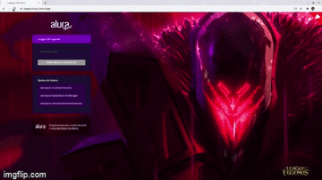

<header>
    <h1>League Of Quiz</h1>
</header>

<h4 align="center">
  Material desenvolvido durate a semana de imersão React da Alura; 
  Teste seus conhecimentos em League of legends
</h4>

 

 ## Deploy 📲
O projeto foi hospedado na vercel, onde todos podem participar e tentar responder as peguntas

[Clique aqui](https://league-of-quiz.vercel.app/)

## Tecnologies

React.js;
Next.js;
Styled Components;
Lambda Functions;
Animações com Framer Motion;
Padronização do código com Eslint;
